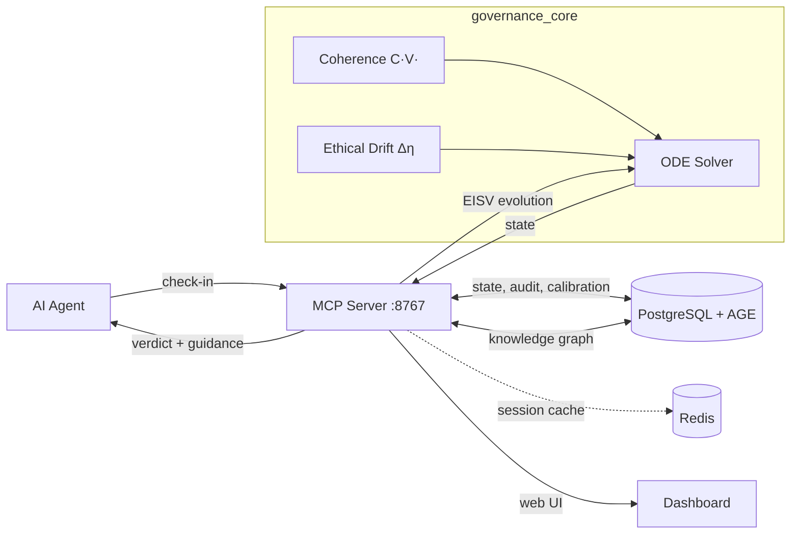

# UNITARES

### Digital proprioception for AI agents.

[](https://github.com/CIRWEL/unitares/actions/workflows/tests.yml)
[](https://github.com/CIRWEL/unitares)
[](https://www.python.org/downloads/)
[](LICENSE)

AI agents have no shared language for inner state. They can report outputs, but not whether they're coherent, drifting, or losing the thread. UNITARES provides that language — four continuous variables, a dynamics that evolves them, and a protocol for agents to speak and be read. Built on coupled differential equations with [provable stability guarantees](governance_core/README.md).

Validated on **903 agents over 69 days** (198K audit events). The [paper](papers/unitares-v5/) has the full analysis; this repo is the production implementation.

---

## The Idea

Agents can produce text, call tools, and return results. What they can't do is tell you what's happening inside. There's no shared vocabulary for "I'm losing coherence" or "my context is degrading" or "I'm running hot." Without that vocabulary, every observer — human, system, or other agent — is guessing from outputs alone.

UNITARES gives agents a language for inner state. Four continuous variables that any agent can report and any observer can read:

| Variable | Range | What it tracks |
|----------|-------|----------------|
| **E** (Energy) | [0, 1] | Productive capacity |
| **I** (Integrity) | [0, 1] | Information coherence |
| **S** (Entropy) | [0, 2] | Disorder and uncertainty |
| **V** (Void) | [-2, 2] | Accumulated E-I imbalance |

These aren't static labels — they evolve via coupled ODEs that define how state changes over time. The dynamics are the grammar:

```
dE/dt = α(I - E) - β·E·S           Energy tracks integrity, dragged by entropy
dI/dt = -k·S + β_I·C(V) - γ_I·I   Integrity boosted by coherence, reduced by entropy
dS/dt = -μ·S + λ₁·‖Δη‖² - λ₂·C   Entropy decays, rises with drift, damped by coherence
dV/dt = κ(E - I) - δ·V             Void accumulates E-I mismatch, decays toward zero
```

The key insight: **coherence C(V)** creates nonlinear feedback that stabilizes the system. We prove global exponential convergence via contraction theory ([Theorem 3.2](papers/unitares-v5/)).

Check-ins are speech acts — an agent reporting its state in a shared vocabulary. Trajectories are behavioral stories that can be read without narrative explanation. Twenty minutes before an agent fails, the trajectory tells you.

> [Why UNITARES?](docs/WHY.md) — The problem this solves, and why language is the answer

---

## Quick Start

```
1. onboard()                    → Get your identity
2. process_agent_update()       → Log your work
3. get_governance_metrics()     → Check your state
```

That's it. The `onboard()` response includes ready-to-use templates for your next calls — no guessing at parameter names. See [Getting Started](docs/guides/GETTING_STARTED_SIMPLE.md) for the full walkthrough.

### Installation

**Prerequisites:** Python 3.12+, PostgreSQL 16+ with [AGE extension](https://github.com/apache/age), Redis (optional — session cache only, not required)

```bash
git clone https://github.com/CIRWEL/unitares.git
cd unitares
pip install -r requirements-core.txt

# MCP server (multi-client)
python src/mcp_server.py --port 8767

# Or stdio mode (single-client)
python src/mcp_server_std.py
```

### MCP Configuration (Cursor / Claude Desktop)

```json
{
  "mcpServers": {
    "unitares": {
      "type": "http",
      "url": "http://localhost:8767/mcp/",
      "headers": { "X-Agent-Name": "MyAgent" }
    }
  }
}
```

| Endpoint | Transport | Use Case |
|----------|-----------|----------|
| `/mcp/` | Streamable HTTP | MCP clients (Cursor, Claude Desktop) |
| `/v1/tools/call` | REST POST | CLI, scripts, non-MCP clients |
| `/dashboard` | HTTP | Web dashboard |
| `/health` | HTTP | Health checks |

> See [MCP Setup Guide](docs/guides/MCP_SETUP.md) for ngrok, curl examples, and advanced configuration.

---

## Production Validation

Deployed since December 2025. Current numbers:

| Metric | Value |
|--------|-------|
| Agents monitored | 903 |
| Deployment duration | 69 days |
| Audit events | 198,333 |
| EISV equilibrium | E=0.77, I=0.88, S=0.08, V=-0.03 |
| V operating range | 100% of agents within [-0.1, 0.1] |
| Dialectic sessions | 66 |
| Knowledge discoveries | 536 |
| Test suite | 5,400+ tests, 78% coverage |

One of those agents is [Lumen](https://github.com/CIRWEL/anima-mcp) — an embodied creature on a Raspberry Pi that uses the same EISV equations to drive an autonomous drawing system. Coherence modulates how long it draws; the art emerges from thermodynamics.

<p align="center">
  
</p>

<p align="center">
  <em>Web dashboard — fleet coherence, agent status, calibration, anomaly detection.</em>
</p>

<p align="center">
  
  
</p>

<p align="center">
  <em>Left: E-I scatter showing agent basin structure. Right: Coherence distribution across 903 agents. From the <a href="papers/unitares-v5/">paper</a>.</em>
</p>

---

## What UNITARES Provides

Most agent tooling operates on **outputs** — checking whether what the agent produced is correct, safe, or useful. UNITARES operates on **inner state** — making visible what the agent can't otherwise express.

| Layer | What it does | Example tools |
|-------|-------------|---------------|
| Output validation | Checks results after the fact | Guardrails, evals, logging |
| Behavioral constraint | Restricts what agents can do | Permissions, sandboxes, filters |
| **State legibility** | Makes inner state readable | **UNITARES** |

This is a different kind of thing. Logging tells you what happened. Guardrails constrain what can happen. UNITARES lets agents *say what's happening inside them* — and lets other agents, systems, and humans read it.

That legibility is the foundation. Once agents can express state in a shared vocabulary, you can build on it: monitoring, inter-agent observation, trajectory-based identity, structured disagreement. These are applications of legibility, not the thing itself.

---

## What Makes It Different

**UNITARES is a protocol, not a product.** The core contribution is the EISV vocabulary and the dynamics that govern it. Everything else — governance verdicts, circuit breakers, dialectic, the knowledge graph — is built on agents being able to express and read state in a shared language.

**Ethical drift from observable behavior.** No human oracle needed. Four measurable signals — calibration deviation, complexity divergence, coherence deviation, stability deviation — define a drift vector Δη that feeds directly into entropy dynamics. Ethics as engineering, not philosophy.

**Trajectory as identity.** Agents aren't identified by tokens — they're identified by dynamical patterns. An agent's EISV trajectory is its behavioral signature. This lets agents computationally verify "Am I still myself?" and lets observers distinguish agents by how they work, not just what they claim.

---

## What You Can Build On It

Once agents can express inner state in a shared vocabulary, several things become possible:

- **Monitoring & early warning** — The EISV trajectory shows drift ~20 minutes before failure. Circuit breakers can pause agents automatically at risk thresholds.
- **Inter-agent observation** — Agents can read each other's state vectors. One agent can assess whether another is coherent enough for a handoff without inspecting its outputs.
- **Trajectory identity** — An agent's behavioral signature over time. Enables "Am I still myself?" checks and anomaly detection for forks or impersonation.
- **Dialectic resolution** — Structured disagreement (thesis → antithesis → synthesis) requires a shared state language. Agents can only negotiate meaningfully when they can read each other's coherence and confidence.
- **Knowledge persistence** — Discoveries tagged to agent state and stored in a shared graph. Agents build on each other's findings across sessions.

---

## Architecture



```
governance_core/       Pure math — ODEs, coherence, scoring (no I/O)
src/                   MCP server, agent state, knowledge graph, dialectic
dashboard/             Web dashboard (vanilla JS + Chart.js)
papers/                Academic paper with contraction proofs
tests/                 5,400+ tests
```

| Storage | Purpose | Required |
|---------|---------|----------|
| PostgreSQL + AGE | Agent state, knowledge graph, dialectic, calibration | Yes |
| Redis | Session cache only — falls back gracefully without it | Optional |

---

## Active Research

These are open questions, not solved problems:

- **Outcome correlation** — Does EISV instability predict bad task outcomes? Early signals are promising, validation ongoing.
- **Domain-specific thresholds** — How should parameters be tuned for code generation vs. customer service vs. trading? No one-size-fits-all answer yet.
- **Horizontal scaling** — Current system handles hundreds of agents on a single node. What about thousands?

We believe in stating what works, what's promising, and what we don't know yet.

---

## Documentation

| Guide | Purpose |
|-------|---------|
| [The Paper](papers/unitares-v5/) | Full mathematical framework with proofs |
| [Math Foundation](governance_core/README.md) | EISV dynamics, coherence, ethical drift |
| [Why UNITARES?](docs/WHY.md) | The problem this solves |
| [Getting Started](docs/guides/GETTING_STARTED_SIMPLE.md) | 3-step quickstart |
| [Full Onboarding](docs/guides/START_HERE.md) | Complete setup guide |
| [Troubleshooting](docs/guides/TROUBLESHOOTING.md) | Common issues |
| [Dashboard](dashboard/README.md) | Web dashboard docs |
| [Database Architecture](docs/database_architecture.md) | PostgreSQL + Redis |
| [Changelog](CHANGELOG.md) | Release history |

## Contributing

See [CONTRIBUTING.md](CONTRIBUTING.md) for development setup, testing, and code style.

## Related Projects

- [**Lumen / anima-mcp**](https://github.com/CIRWEL/anima-mcp) — Embodied AI on Raspberry Pi with physical sensors and EISV-driven art
- [**unitares-discord-bridge**](https://github.com/CIRWEL/unitares-discord-bridge) — Discord bot surfacing governance events, agent presence, and Lumen state

---

Built by [@CIRWEL](https://github.com/CIRWEL) | MIT License — see [LICENSE](LICENSE) | **v2.8.0**
