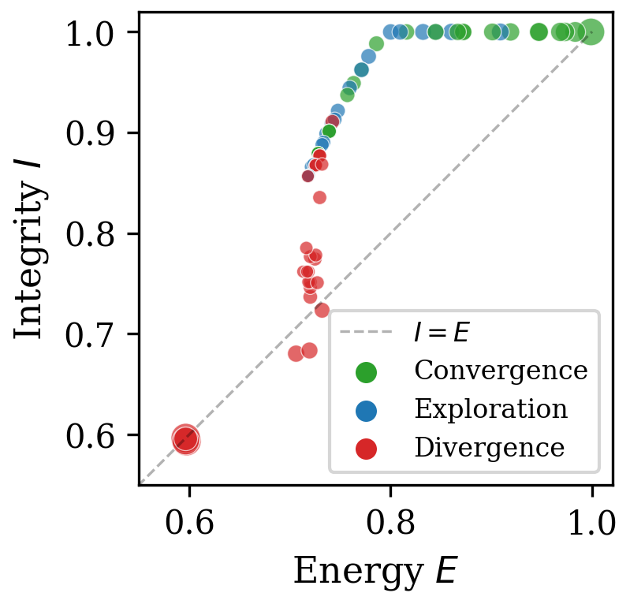
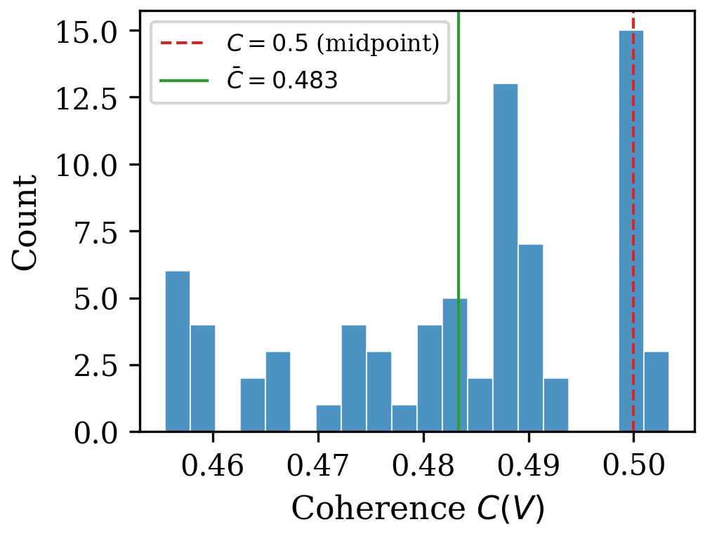
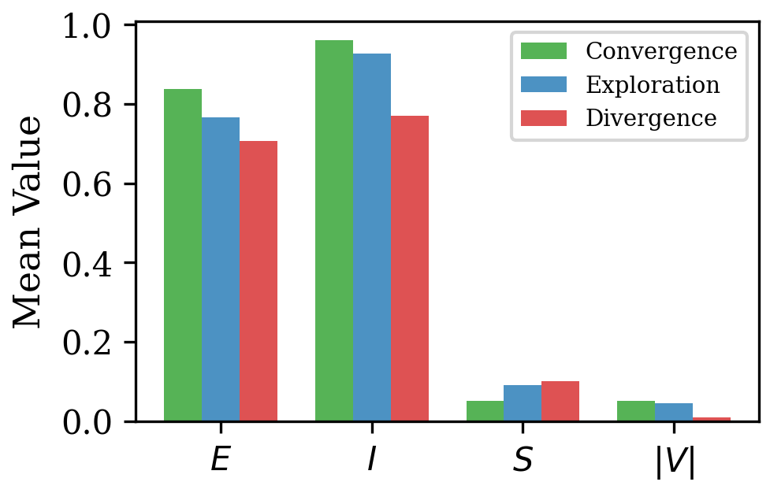
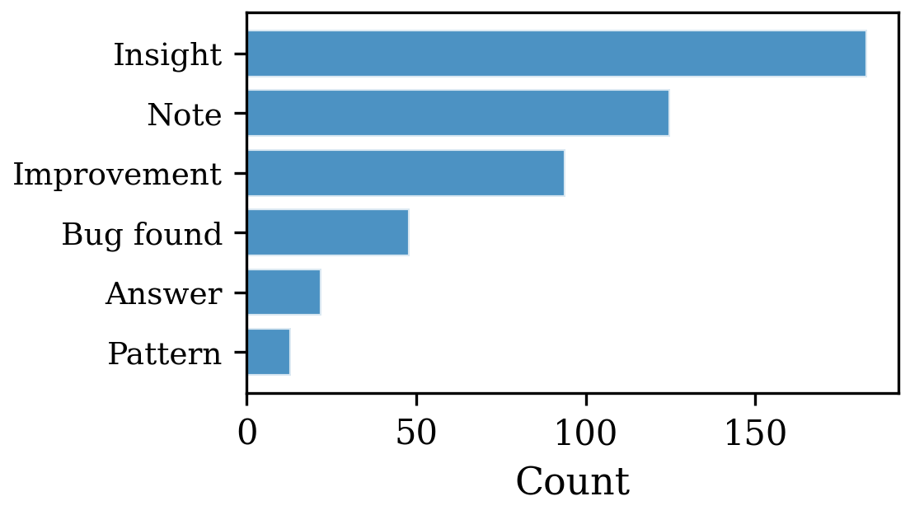
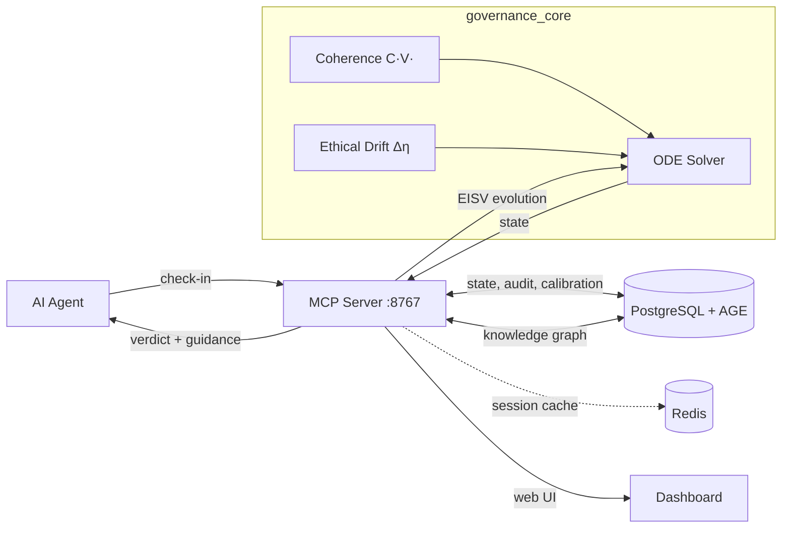

# UNITARES

### Digital proprioception for AI agents.

[](https://github.com/CIRWEL/unitares/actions/workflows/tests.yml)
[](https://github.com/CIRWEL/unitares)
[](https://www.python.org/downloads/)
[](LICENSE)

AI agents today have no body sense. They can't tell if they're drifting, looping, or degrading until they crash. UNITARES gives agents continuous awareness of their own state using coupled differential equations with [provable stability guarantees](governance_core/README.md).

We've validated the framework on **903 agents over 69 days** (198K audit events). The [paper](papers/unitares-v5/) has the full analysis; this repo is the production implementation.

> *"The Self isn't coded; it accretes like a pearl."*

---

## The Idea

Agents don't fail suddenly. They **drift** toward failure. Logs tell you what happened; alerts tell you something broke. Neither tells you it's *happening*.

UNITARES models agent state as a thermodynamic system with four continuous variables:

| Variable | Range | What it tracks |
|----------|-------|----------------|
| **E** (Energy) | [0, 1] | Productive capacity |
| **I** (Integrity) | [0, 1] | Information coherence |
| **S** (Entropy) | [0, 2] | Disorder and uncertainty |
| **V** (Void) | [-2, 2] | Accumulated E-I imbalance |

These evolve via coupled ODEs:

```
dE/dt = α(I - E) - β·E·S           Energy tracks integrity, dragged by entropy
dI/dt = -k·S + β_I·C(V) - γ_I·I   Integrity boosted by coherence, reduced by entropy
dS/dt = -μ·S + λ₁·‖Δη‖² - λ₂·C   Entropy decays, rises with drift, damped by coherence
dV/dt = κ(E - I) - δ·V             Void accumulates E-I mismatch, decays toward zero
```

The key insight: **coherence C(V)** creates nonlinear feedback that stabilizes the system. We prove global exponential convergence via contraction theory ([Theorem 3.2](papers/unitares-v5/)).

Twenty minutes before an agent fails, you see it trending. Intervene, or let the circuit breaker pause it automatically.

> [Why UNITARES?](docs/WHY.md) — Concrete failure modes this solves

---

## Three Novel Contributions

**1. Ethical drift from observable behavior.** No human oracle needed. Four measurable signals — calibration deviation, complexity divergence, coherence deviation, stability deviation — define a drift vector Δη that feeds directly into entropy dynamics. Ethics as engineering, not philosophy.

**2. Adaptive PID governance (CIRS v2).** Governance thresholds are per-agent state variables, not static config. Phase-aware reference tracking with oscillation damping. Multi-agent resonance detection prevents feedback loops between coordinated agents.

**3. Trajectory identity.** Agents aren't identified by tokens — they're identified by dynamical patterns. Grounded in enactive cognition (Varela & Thompson), this lets agents computationally verify "Am I still myself?" and detect forks, anomalies, and drift.

---

## Lumen: Embodied Proprioception

[Lumen](https://github.com/CIRWEL/anima-mcp) is an AI creature running on a Raspberry Pi with physical sensors (temperature, humidity, light, neural bands). It uses the same EISV equations to drive a drawing system — coherence directly modulates how long it can draw and how selective it is about saving.

A confused Lumen draws in short, erratic bursts. A focused Lumen draws flowing, sustained compositions. The art emerges from thermodynamics.

---

## Quick Start

Three calls to go from zero to governed:

```
1. onboard()                    → Get your identity
2. process_agent_update()       → Log your work
3. get_governance_metrics()     → Check your state
```

Here's what `onboard()` returns:

```json
{
  "welcome": "Welcome, my_agent_20260306_a1b2c3d4!",
  "agent_id": "mcp_20260306",
  "client_session_id": "agent-a1b2c3d4-001",
  "session_continuity": {
    "instruction": "Include client_session_id in ALL future tool calls"
  },
  "next_calls": [
    {
      "tool": "process_agent_update",
      "why": "Log your work. Call after completing tasks.",
      "args_min": { "response_text": "...", "complexity": 0.5 }
    },
    {
      "tool": "get_governance_metrics",
      "why": "Check your state (energy, coherence, etc.)"
    }
  ]
}
```

The response includes ready-to-use templates for your next calls — no guessing at parameter names. See [Getting Started](docs/guides/GETTING_STARTED_SIMPLE.md) for the full walkthrough.

### Installation

**Prerequisites:** Python 3.12+, PostgreSQL 16+ with [AGE extension](https://github.com/apache/age), Redis (optional — session cache only, not required)

```bash
git clone https://github.com/CIRWEL/unitares.git
cd unitares
pip install -r requirements-core.txt

# MCP server (multi-client)
python src/mcp_server.py --port 8767

# Or stdio mode (single-client)
python src/mcp_server_std.py
```

### MCP Configuration (Cursor / Claude Desktop)

```json
{
  "mcpServers": {
    "unitares": {
      "type": "http",
      "url": "http://localhost:8767/mcp/",
      "headers": { "X-Agent-Name": "MyAgent" }
    }
  }
}
```

| Endpoint | Transport | Use Case |
|----------|-----------|----------|
| `/mcp/` | Streamable HTTP | MCP clients (Cursor, Claude Desktop) |
| `/v1/tools/call` | REST POST | CLI, scripts, non-MCP clients |
| `/dashboard` | HTTP | Web dashboard |
| `/health` | HTTP | Health checks |

> See [MCP Setup Guide](docs/guides/MCP_SETUP.md) for ngrok, curl examples, and advanced configuration.

---

## Production Validation

Deployed since December 2025. Current numbers:

| Metric | Value |
|--------|-------|
| Agents monitored | 903 |
| Deployment duration | 69 days |
| Audit events | 198,333 |
| EISV equilibrium | E=0.77, I=0.88, S=0.08, V=-0.03 |
| V operating range | 100% of agents within [-0.1, 0.1] |
| Dialectic sessions | 66 |
| Knowledge discoveries | 536 |
| Test suite | 5,400+ tests, 78% coverage |

### See It In Action

<p align="center">
  
</p>

<p align="center">
  <em>Web dashboard — fleet coherence, agent status, calibration, anomaly detection. Auto-refreshes every 30 seconds.</em>
</p>

<p align="center">
  
  
</p>

<p align="center">
  <em>Left: E-I scatter plot showing agent basin structure. Right: Coherence distribution across 903 agents.</em>
</p>

<p align="center">
  
  
</p>

<p align="center">
  <em>Left: EISV regime profiles across operating modes. Right: Knowledge graph discovery type distribution.</em>
</p>

> All figures from real production data. See the [paper](papers/unitares-v5/) for methodology and analysis.

---

## Architecture



```
governance_core/       Pure math — ODEs, coherence, scoring (no I/O)
src/                   MCP server, agent state, knowledge graph, dialectic
dashboard/             Web dashboard (vanilla JS + Chart.js)
papers/                Academic paper with contraction proofs
tests/                 5,400+ tests
```

| Storage | Purpose | Required |
|---------|---------|----------|
| PostgreSQL + AGE | Agent state, knowledge graph, dialectic, calibration | Yes |
| Redis | Session cache only — falls back gracefully without it | Optional |

---

## Documentation

| Guide | Purpose |
|-------|---------|
| [The Paper](papers/unitares-v5/) | Full mathematical framework with proofs |
| [Math Foundation](governance_core/README.md) | EISV dynamics, coherence, ethical drift |
| [Why UNITARES?](docs/WHY.md) | The problem this solves |
| [Getting Started](docs/guides/GETTING_STARTED_SIMPLE.md) | 3-step quickstart |
| [Full Onboarding](docs/guides/START_HERE.md) | Complete setup guide |
| [Troubleshooting](docs/guides/TROUBLESHOOTING.md) | Common issues |
| [Dashboard](dashboard/README.md) | Web dashboard docs |
| [Database Architecture](docs/database_architecture.md) | PostgreSQL + Redis |
| [Changelog](CHANGELOG.md) | Release history |

---

## How It Compares

Most agent monitoring is **retrospective** — logs, traces, metrics dashboards that tell you what already happened. UNITARES is **prospective**: the ODE system models drift as it's happening, before failure.

| Approach | Tells you | When |
|----------|-----------|------|
| Logging (OpenTelemetry, etc.) | What happened | After |
| Guardrails (Guardrails AI, NeMo) | Whether output is safe | Per-request |
| Evals (Braintrust, LangSmith) | Whether quality changed | After batch |
| **UNITARES** | Whether the agent is drifting | Continuously, ~20 min early warning |

UNITARES doesn't replace these — it adds a layer they don't cover. You can run guardrails on every request and still miss that your agent's calibration has been degrading for the last hour. The EISV dynamics catch that.

---

## Active Research

These are open questions, not solved problems:

- **Outcome correlation** — Does EISV instability predict bad task outcomes? Early signals are promising, validation ongoing.
- **Domain-specific thresholds** — How should parameters be tuned for code generation vs. customer service vs. trading? No one-size-fits-all answer yet.
- **Horizontal scaling** — Current system handles hundreds of agents on a single node. What about thousands?

We believe in stating what works, what's promising, and what we don't know yet.

---

## Related Projects

- [**Lumen / anima-mcp**](https://github.com/CIRWEL/anima-mcp) — Embodied AI on Raspberry Pi with physical sensors and EISV-driven art
- [**unitares-discord-bridge**](https://github.com/CIRWEL/unitares-discord-bridge) — Discord bot surfacing governance events, agent presence, and Lumen state

---

## Contributing

See [CONTRIBUTING.md](CONTRIBUTING.md) for development setup, testing, and code style. The test suite has 5,400+ tests — run it before submitting:

```bash
python3 -m pytest tests/ -x -q --ignore=tests/test_admin_handlers.py
```

---

Built by [@CIRWEL](https://github.com/CIRWEL) | MIT License — see [LICENSE](LICENSE) | **v2.8.0**
